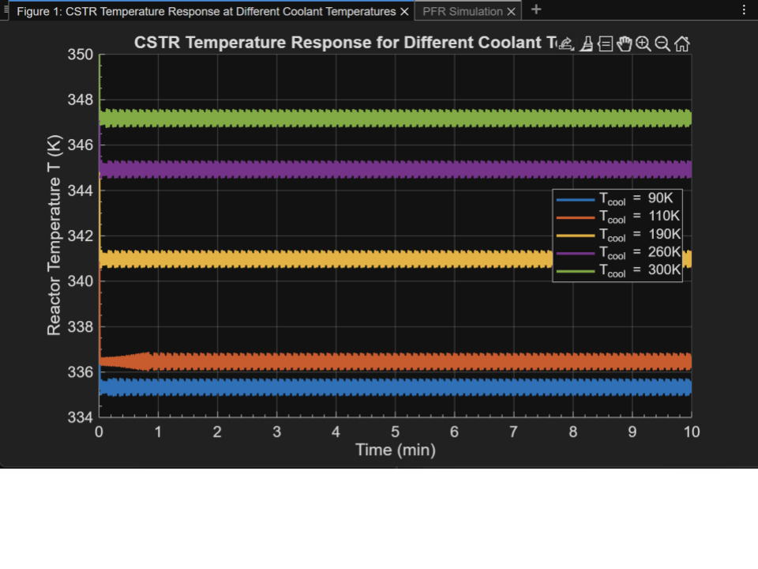
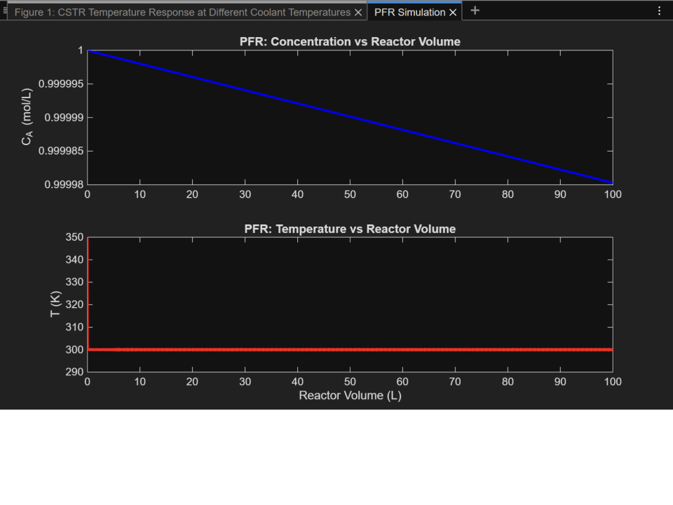

# MATLAB Chemical Reactor Simulation: CSTR + PFR

This project simulates a **Continuous Stirred Tank Reactor (CSTR)** and a **Plug Flow Reactor (PFR)** in MATLAB for an **exothermic A → B reaction**. The simulation calculates and visualizes concentration and temperature profiles over time (CSTR) and space (PFR).

---

## Features

- **CSTR**: Dynamic simulation with heat transfer
- **PFR**: Steady-state simulation
- **Exothermic reaction**: Models heat generation
- **Coolant temperature sweep**: Multiple curves for analysis
- **Realistic plots** of reactor behavior

---

## Files

- `modeling.m`: Main script for CSTR & PFR simulations
- `/output/`: Folder for saved plots (optional)

---

## Example Output

**CSTR: Temperature vs Time**  

**PFR: Temperature vs Reactor Volume**  

---

## How to Run

1. Open `modeling.m` in MATLAB.
2. Run the script. Plots will display automatically.

---

## Author

**Kachi Ezuma-Ngwu**  
Chemical Engineering Student @ Yale University  
[LinkedIn](https://www.linkedin.com/in/onyedikachi-ezuma-ngwu-356957299/) | 
[Resume Portfolio](https://github.com/Kachiezn)

---

## License

MIT License  
